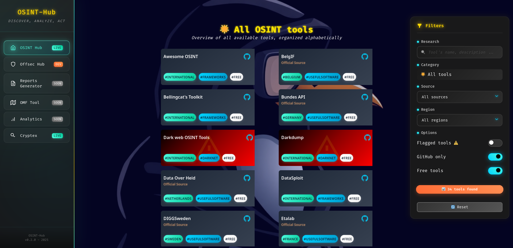

# OSINT-Hub

This README is also available in [🇫🇷 French](./README_fr.md)

**OSINT-Hub** is a comprehensive web platform aggregating OSINT (Open Source Intelligence) and offensive security resources with advanced filtering capabilities. The platform is designed as an evolving ecosystem with multiple specialized hubs in active development.

---

## Overview

OSINT-Hub provides a centralized interface for security professionals, researchers, and enthusiasts to discover and access tools across multiple domains. The platform organizes resources by categories including reconnaissance, social engineering, web application testing, forensics, and more, with a focus on Western European resources while maintaining global coverage.



---

## Vision

OSINT-Hub is designed as an **evolving ecosystem** of security intelligence tools. While currently featuring two main hubs (OSINT and Offensive Security), the platform architecture supports unlimited expansion. Future additions will cover:

- Threat intelligence and monitoring
- Automated reporting and documentation
- Collaborative investigation workspaces  
- Specialized regional and industry-specific toolsets
- API integrations for direct tool access

Check the navigation sidebar to see which sections are live, under development, or coming soon. The platform is in active development with regular updates and new capabilities.

---

## Features

### Core Functionality
- **Multi-hub platform architecture**: Currently featuring OSINT and Offensive Security sections, with additional specialized hubs in active development
- **Modern navigation menu**: Elegant sidebar clearly indicating tool status (Live, Dev, Soon) for current and upcoming features
- **Dynamic iframe-based page loading**: Smooth transitions between sections
- **Legal warning system**: Prominent disclaimer toast for responsible usage

### Advanced Filtering System
- **Multi-dimensional filtering**:
  - Category-based organization (14+ categories for OSINT, 13+ for Offsec)
  - Source type filtering (GitHub, official websites, APIs, government resources)
  - Geographic/regional filtering (International, European countries, etc.)
  - Danger level indicators (Low, Medium, High, Extreme risk)
  - Free vs. paid tool distinction
  - Flagged/verified tool status
- **Real-time search**: Instant text-based filtering across tool names and descriptions
- **Results counter**: Live count of matching tools
- **Toggle switches**: Intuitive controls for quick filter adjustments
- **Reset functionality**: One-click filter reset

### User Experience
- **Responsive design**: Optimized for desktop and mobile devices
- **Particle animation background**: Dynamic visual effects
- **Glassmorphism UI**: Modern backdrop blur effects and translucent containers
- **Neon aesthetics**: Cyberpunk-inspired color scheme with glowing accents
- **Smooth transitions**: CSS animations and hover effects throughout
- **Mobile menu**: Hamburger navigation for smaller screens

### Technical Features
- **Flask backend**: Lightweight Python server for local hosting
- **Auto-port detection**: Automatically finds available ports (8000-9000 range)
- **CORS-enabled**: Proper cross-origin configuration
- **JSON API**: Structured tool data in `api/tools.json`
- **Static asset management**: Organized file structure with dedicated static folder

---

## Installation & Usage

### Prerequisites
- Python 3.7 or higher
- pip (Python package manager)

### Quick Start

1. **Clone or download the repository**:
   ```bash
   git clone https://github.com/ThePinguin073/osint-hub.git
   cd osint-hub
   ```

2. **Install dependencies**:
   ```bash
   pip install -r requirements.txt
   ```
   
   Required packages:
   - Flask
   - flask-cors

3. **Run the application**:
   ```bash
   python app.py
   ```
   
   The server will automatically find an available port between 8000-9000 and display:
   ```
   * Running on http://127.0.0.1:XXXX
   ```

4. **Access the platform**:
   - Open your browser
   - Navigate to the URL displayed in the terminal
   - Accept the legal warning to proceed

---

## Project Structure

```
osint-hub/
├── app.py                 # Flask application server
├── requirements.txt       # Python dependencies
├── api/
│   └── tools.json        # Tool database
├── frontend/
│   ├── index.html        # Main navigation page
│   ├── osint.html        # OSINT tools section
│   ├── offsec.html       # Offensive security section
│   ├── soon.html         # Coming soon placeholder
│   └── static/
│       ├── favicon.ico
│       ├── osint-hub.css
│       ├── osint-hub.js
│       └── background.jpg
├── screenshot.png
├── LICENSE
└── README.md
```

---

## Tool Categories

### OSINT Hub
- 🔍 Reconnaissance & OSINT
- 🏷️ Usernames
- 👥 Social Media
- ✉️ Email Addresses
- 📱 Phone Numbers
- 🕸️ Domains & URLs
- 🌐 IP Addresses
- 🧭 Geolocation & Maps
- 🖼️ Images & Visual Search
- 🏢 Companies & Business
- 🧅 Darknet Tools
- 🧾 Data Leaks
- ₿ Cryptocurrencies
- 📰 News & Media
- 🔧 Useful Software
- 🗂️ OSINT Frameworks

### Offensive Security Hub
- 🔍 Reconnaissance
- 📡 Scanning & Enumeration
- 💥 Exploitation
- 🕷️ Post-Exploitation
- 🌐 Web Application Testing
- 📶 Wireless Security
- 👥 Social Engineering
- 🔐 Password Attacks
- 🔬 Digital Forensics
- 🌍 Network Analysis
- 📱 Mobile Security
- ⚙️ Reverse Engineering
- 🛡️ Malware Development Tools
- 🗂️ Frameworks & Distributions

---

## Legal Disclaimer

**IMPORTANT**: This platform aggregates tools that can be used for both legitimate security research and malicious purposes. Users are **fully responsible** for:

- Compliance with local, national, and international laws
- Obtaining proper authorization before testing systems
- Ethical use of all tools and techniques
- Understanding the legal implications in their jurisdiction

The creators and contributors assume **no liability** for misuse of this platform or the tools it references. This is provided for educational and authorized security testing purposes only.

---

## Changelog

### [v0.2.0 - 2025-01-XX]
- Complete UI/UX overhaul with modern design system
- Added Offensive Security hub with 100+ tools
- Implemented Flask backend for improved routing
- Created navigation menu with iframe-based loading
- Added legal warning system
- Enhanced filtering with danger levels and multi-criteria support
- Mobile responsive improvements
- Particle animation effects
- Glassmorphism and neon design elements

### [v0.1.0 - 2025-01-06]
- Initial release with OSINT tools collection
- Basic filtering system
- Frontend-only implementation
- Category organization

---

## Roadmap

### In Active Development

The platform is continuously expanding beyond its current OSINT and Offensive Security hubs. Upcoming tools and features include:

#### Coming Soon
- **📄 Reports Generator**: Automated OSINT investigation report creation with customizable templates and export formats
- **🗺️ OMF Tool**: OSINT Methodology Framework integration for guided research processes and best practice workflows
- **📊 Analytics Dashboard**: Usage statistics and tool popularity metrics

#### Under Development
- **Enhanced Offsec Hub**: Additional exploit frameworks, post-exploitation tools, and automation scripts
- **API Integration**: Direct tool integrations for streamlined workflows and automation

The navigation menu displays the current status of each section, making it easy to track which tools are live, in development, or planned for future releases. Check back regularly for updates!

---

## Contributing

Contributions are welcome! To contribute:

1. Fork the repository
2. Create a feature branch (`git checkout -b feature/YourFeature`)
3. Make your changes
4. Test thoroughly
5. Submit a pull request

### Contribution Ideas
- Add new tools to the database
- Translate to additional languages
- Fix bugs or improve documentation
- Add new categories or features
- Suggest new hubs or sections

---

## Acknowledgments

This project builds upon the work of countless OSINT practitioners, security researchers, and open-source developers. Special thanks to:

- The OSINT community for tool development and knowledge sharing
- Security researchers advancing offensive security techniques ethically
- Open-source contributors whose tools are featured here
- Projects like Kali Linux, OWASP, and MITRE ATT&CK for framework inspiration

---

## License

This project is licensed under the Apache 2.0 License. See [LICENSE](LICENSE) file for details.

---

## Support & Contact

- **Issues**: Report bugs via [GitHub Issues](https://github.com/ThePinguin073/osint-hub/issues)
- **Creator**: ThePinguin073
- **Related Project**: [Cryptex](https://cryptexhq.github.io/)

---

**Remember**: With great tools comes great responsibility. Always operate legally, ethically, and with proper authorization.

Happy (ethical) hunting! 🔍🛡️