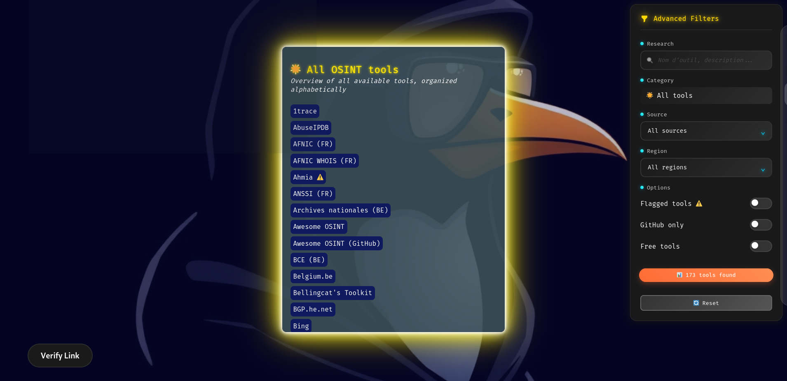

# OSINT hub

Ce fichier est également disponible en [🇬🇧 anglais](./README.md)

**OSINT hub** est une page web qui regroupe un large éventail de ressources et d’outils OSINT, avec un accent particulier sur la France, la Belgique et l’Europe de l’Ouest.

---

## Vue d’ensemble

Cet outil organise des liens spécialisés par catégories telles que pseudonymes, réseaux sociaux, géolocalisation, darknet, entreprises, et bien d’autres.  
Il est conçu pour les praticiens OSINT à la recherche d’une plateforme simple, complète, et entièrement en frontend.

---

## Fonctionnalités

- Interface épurée et intuitive avec filtrage dynamique par catégorie  
- **Système de multi-filtres avancé** permettant de combiner plusieurs critères :  
  - Outils gratuits vs payants  
  - Provenance des sources (ex. : GitHub, autres référentiels)  
  - Origine géographique (pays)  
  - Statut signalé / vérifié  
  - Recherche en texte intégral sur les noms des outils  
- Mise à jour en temps réel du nombre de résultats visibles  
- Combinaison de boutons/toggles et menus déroulants pour une recherche granulaire  
- Rendu optimisé pour des centaines de liens sans latence d’interface  
- Vérificateur de liens morts intégré pour contrôler la disponibilité des ressources  
- Design responsive avec fallback pour les petits écrans  
- **100 % en frontend** : aucun backend ou serveur requis  

---

## Utilisation

**Accédez à la page GitHub du dépôt :**  
[https://github.com/ThePinguin073/osint-hub]

**Téléchargez les fichiers :**  
- Cliquez sur le bouton vert `<> Code`  
- Puis sélectionnez **Download ZIP**  
- Extrayez l’archive ZIP (clic droit → *Extraire tout*)

**Ouvrez la page web :**  
- Dans le dossier extrait, ouvrez `index.html` avec votre navigateur (Chrome, Firefox, Edge, etc.)

> Aucune installation ni compétence technique n’est requise.  
> Tout fonctionne **localement**, **hors ligne**, sans connexion serveur.

---

## Journal des modifications

### [Dernière mise à jour - 2025-08-06]
- Refactorisation majeure du système de filtres :  
  - Remplacement du menu déroulant unique par un moteur de multi-filtres robuste  
  - Ajout de toggles pour filtrer les outils gratuits, les sources GitHub, les outils signalés, et par pays  
  - Amélioration de l’UX avec recherche en temps réel et critères combinés  
  - Rendu optimisé pour de meilleures performances avec de gros volumes de données  
  - Amélioration du compteur de résultats et de la fonction de réinitialisation des filtres  

---

## Remerciements

Ce projet s’appuie sur le travail remarquable de nombreux contributeurs open source, chercheurs et développeurs OSINT, dont les outils sont référencés ici.  
Merci à tous ceux qui font avancer la communauté OSINT par leur dévouement et leur esprit de partage.

---

## Contributions & Suggestions

Vos retours sont les bienvenus pour améliorer cet outil : corrections, ajouts, optimisations ou propositions de ressources complémentaires.  
N’hésitez pas à **ouvrir une issue** ou à **soumettre une pull request** sur ce dépôt.

---

## Licence

Ce projet est sous licence **Apache 2.0**.

---

**Créé par ThePinguin073**  
Bonne exploration OSINT, toujours légale et éthique.
