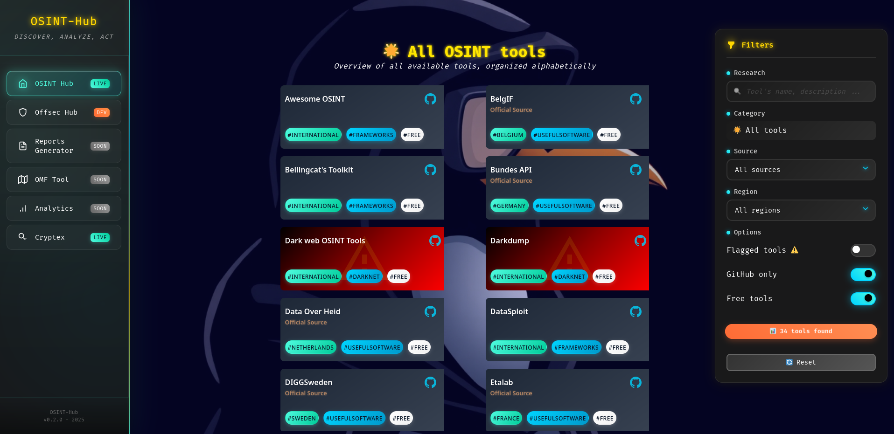

# OSINT-Hub

Ce README est également disponible en [🇬🇧 Anglais](./README.md)

**OSINT-Hub** est une plateforme web complète regroupant des ressources OSINT (Open Source Intelligence) et de sécurité offensive avec des capacités de filtrage avancées. La plateforme est conçue comme un écosystème évolutif avec plusieurs hubs spécialisés en développement actif.

---

## Aperçu

OSINT-Hub fournit une interface centralisée pour les professionnels de la sécurité, chercheurs et passionnés afin de découvrir et accéder à des outils dans plusieurs domaines. La plateforme organise les ressources par catégories incluant la reconnaissance, l'ingénierie sociale, les tests d'applications web, la criminalistique numérique et plus encore, avec un accent sur les ressources d'Europe de l'Ouest tout en maintenant une couverture mondiale.



---

## Vision

OSINT-Hub est conçu comme un **écosystème évolutif** d'outils de renseignement en sécurité. Bien que présentant actuellement deux hubs principaux (OSINT et Sécurité Offensive), l'architecture de la plateforme supporte une expansion illimitée. Les futurs ajouts couvriront :

- Le renseignement sur les menaces et la surveillance
- La génération automatisée de rapports et la documentation
- Des espaces de travail d'investigation collaboratifs
- Des ensembles d'outils spécialisés régionaux et sectoriels
- Des intégrations d'API pour un accès direct aux outils

Consultez la barre de navigation latérale pour voir quelles sections sont actives, en développement ou à venir. La plateforme est en développement actif avec des mises à jour régulières et de nouvelles fonctionnalités.

---

## Fonctionnalités

### Fonctionnalités principales
- **Architecture multi-hub** : Actuellement avec les sections OSINT et Sécurité Offensive, avec des hubs spécialisés supplémentaires en développement actif
- **Menu de navigation moderne** : Barre latérale élégante indiquant clairement le statut des outils (Live, Dev, Soon) pour les fonctionnalités actuelles et à venir
- **Chargement dynamique des pages par iframe** : Transitions fluides entre les sections
- **Système d'avertissement légal** : Toast d'avertissement proéminent pour une utilisation responsable

### Système de filtrage avancé
- **Filtrage multi-dimensionnel** :
  - Organisation par catégories (14+ catégories pour OSINT, 13+ pour Offsec)
  - Filtrage par type de source (GitHub, sites officiels, API, ressources gouvernementales)
  - Filtrage géographique/régional (International, pays européens, etc.)
  - Indicateurs de niveau de danger (Risque faible, moyen, élevé, extrême)
  - Distinction outils gratuits vs payants
  - Statut d'outils signalés/vérifiés
- **Recherche en temps réel** : Filtrage instantané par texte sur les noms et descriptions d'outils
- **Compteur de résultats** : Décompte en direct des outils correspondants
- **Boutons à bascule** : Contrôles intuitifs pour des ajustements rapides de filtres
- **Fonction de réinitialisation** : Réinitialisation des filtres en un clic

### Expérience utilisateur
- **Design responsive** : Optimisé pour ordinateurs de bureau et appareils mobiles
- **Fond avec animation de particules** : Effets visuels dynamiques
- **Interface glassmorphisme** : Effets de flou d'arrière-plan modernes et conteneurs translucides
- **Esthétique néon** : Palette de couleurs d'inspiration cyberpunk avec accents lumineux
- **Transitions fluides** : Animations CSS et effets de survol partout
- **Menu mobile** : Navigation hamburger pour petits écrans

### Fonctionnalités techniques
- **Backend Flask** : Serveur Python léger pour l'hébergement local
- **Détection automatique de port** : Trouve automatiquement les ports disponibles (plage 8000-9000)
- **CORS activé** : Configuration cross-origin appropriée
- **API JSON** : Données d'outils structurées dans `api/tools.json`
- **Gestion des ressources statiques** : Structure de fichiers organisée avec dossier statique dédié

---

## Installation et utilisation

### Prérequis
- Python 3.7 ou supérieur
- pip (gestionnaire de paquets Python)

### Démarrage rapide

1. **Cloner ou télécharger le dépôt** :
   ```bash
   git clone https://github.com/ThePinguin073/osint-hub.git
   cd osint-hub
   ```

2. **Installer les dépendances** :
   ```bash
   pip install -r requirements.txt
   ```
   
   Paquets requis :
   - Flask
   - flask-cors

   Note : Si vous rencontrez des conflits de dépendances ou des problèmes d'installation, il est recommandé d'utiliser un environnement virtuel :

   ```bash

   # Créer l'environnement virtuel
      python -m venv venv
      
      # L'activer
      source venv/bin/activate   # Sur Linux/Mac 
      venv\Scripts\activate      # Sur Windows
      
      # Puis installer les dépendances
      pip install -r requirements.txt

   ```

3. **Lancer l'application** :
   ```bash
   python app.py
   ```
   
   Le serveur trouvera automatiquement un port disponible entre 8000-9000 et affichera :
   ```
   * Running on http://127.0.0.1:XXXX
   ```

4. **Accéder à la plateforme** :
   - Ouvrez votre navigateur
   - Naviguez vers l'URL affichée dans le terminal
   - Acceptez l'avertissement légal pour continuer

---

## Structure du projet

```
osint-hub/
├── app.py                 # Serveur d'application Flask
├── requirements.txt       # Dépendances Python
├── api/
│   └── tools.json        # Base de données d'outils
├── frontend/
│   ├── index.html        # Page de navigation principale
│   ├── osint.html        # Section outils OSINT
│   ├── offsec.html       # Section sécurité offensive
│   ├── soon.html         # Page de remplissage "bientôt disponible"
│   └── static/
│       ├── favicon.ico
│       ├── osint-hub.css
│       ├── osint-hub.js
│       └── background.jpg
├── screenshot.png
├── LICENSE
└── README.md
```

---

## Catégories d'outils

### Hub OSINT
- 🔍 Reconnaissance & OSINT
- 🏷️ Noms d'utilisateur
- 👥 Réseaux sociaux
- ✉️ Adresses email
- 📱 Numéros de téléphone
- 🕸️ Domaines & URLs
- 🌐 Adresses IP
- 🧭 Géolocalisation & Cartes
- 🖼️ Images & Recherche visuelle
- 🏢 Entreprises & Business
- 🧅 Outils Darknet
- 🧾 Fuites de données
- ₿ Cryptomonnaies
- 📰 Actualités & Médias
- 🔧 Logiciels utiles
- 🗂️ Frameworks OSINT

### Hub Sécurité Offensive
- 🔍 Reconnaissance
- 📡 Scan & Énumération
- 💥 Exploitation
- 🕷️ Post-Exploitation
- 🌐 Tests d'applications web
- 📶 Sécurité sans fil
- 👥 Ingénierie sociale
- 🔐 Attaques de mots de passe
- 🔬 Criminalistique numérique
- 🌍 Analyse réseau
- 📱 Sécurité mobile
- ⚙️ Rétro-ingénierie
- 🛡️ Outils de développement de malware
- 🗂️ Frameworks & Distributions

---

## Avertissement légal

**IMPORTANT** : Cette plateforme regroupe des outils qui peuvent être utilisés à la fois pour la recherche en sécurité légitime et à des fins malveillantes. Les utilisateurs sont **entièrement responsables** de :

- La conformité aux lois locales, nationales et internationales
- L'obtention d'autorisations appropriées avant de tester des systèmes
- L'utilisation éthique de tous les outils et techniques
- La compréhension des implications légales dans leur juridiction

Les créateurs et contributeurs n'assument **aucune responsabilité** pour l'utilisation abusive de cette plateforme ou des outils qu'elle référence. Ceci est fourni à des fins éducatives et de tests de sécurité autorisés uniquement.

---

## Historique des versions

### [v0.2.0 - 2025-01-XX]
- Refonte complète de l'UI/UX avec système de design moderne
- Ajout du hub Sécurité Offensive avec 100+ outils
- Implémentation du backend Flask pour un routage amélioré
- Création du menu de navigation avec chargement par iframe
- Ajout du système d'avertissement légal
- Amélioration du filtrage avec niveaux de danger et support multi-critères
- Améliorations responsive mobile
- Effets d'animation de particules
- Éléments de design glassmorphisme et néon

### [v0.1.0 - 2025-01-06]
- Version initiale avec collection d'outils OSINT
- Système de filtrage basique
- Implémentation frontend uniquement
- Organisation par catégories

---

## Feuille de route

### En développement actif

La plateforme est en expansion continue au-delà de ses hubs OSINT et Sécurité Offensive actuels. Les outils et fonctionnalités à venir incluent :

#### Bientôt disponible
- **📄 Générateur de rapports** : Création automatisée de rapports d'investigation OSINT avec modèles personnalisables et formats d'export
- **🗺️ Outil OMF** : Intégration du OSINT Methodology Framework pour des processus de recherche guidés et des workflows de bonnes pratiques
- **📊 Tableau de bord analytique** : Statistiques d'utilisation et métriques de popularité des outils

#### En développement
- **Hub Offsec amélioré** : Frameworks d'exploitation supplémentaires, outils de post-exploitation et scripts d'automatisation
- **Intégration d'API** : Intégrations directes d'outils pour des workflows rationalisés et l'automatisation

Le menu de navigation affiche le statut actuel de chaque section, facilitant le suivi des outils en ligne, en développement ou prévus pour de futures versions. Revenez régulièrement pour les mises à jour !

---

## Contribuer

Les contributions sont les bienvenues ! Pour contribuer :

1. Forkez le dépôt
2. Créez une branche de fonctionnalité (`git checkout -b feature/VotreFonctionnalité`)
3. Effectuez vos modifications
4. Testez minutieusement
5. Soumettez une pull request

### Idées de contribution
- Ajouter de nouveaux outils à la base de données
- Traduire dans d'autres langues
- Corriger des bugs ou améliorer la documentation
- Ajouter de nouvelles catégories ou fonctionnalités
- Suggérer de nouveaux hubs ou sections

---

## Remerciements

Ce projet s'appuie sur le travail d'innombrables praticiens OSINT, chercheurs en sécurité et développeurs open-source. Remerciements particuliers à :

- La communauté OSINT pour le développement d'outils et le partage de connaissances
- Les chercheurs en sécurité qui font avancer les techniques de sécurité offensive de manière éthique
- Les contributeurs open-source dont les outils sont présentés ici
- Des projets comme Kali Linux, OWASP et MITRE ATT&CK pour l'inspiration des frameworks

---

## Licence

Ce projet est sous licence Apache 2.0. Consultez le fichier [LICENSE](LICENSE) pour plus de détails.

---

## Support & Contact

- **Problèmes** : Signalez les bugs via [GitHub Issues](https://github.com/ThePinguin073/osint-hub/issues)
- **Créateur** : ThePinguin073
- **Projet associé** : [Cryptex](https://cryptexhq.github.io/)

---

**Rappel** : Un grand pouvoir implique de grandes responsabilités. Opérez toujours légalement, éthiquement et avec une autorisation appropriée.

Bonne chasse (éthique) ! 🔍🛡️